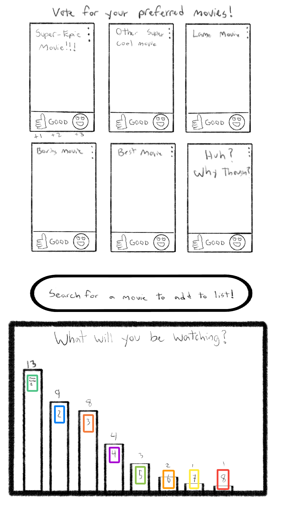
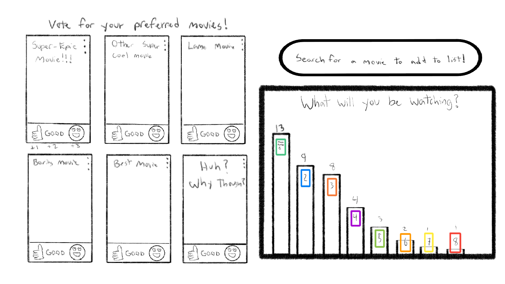
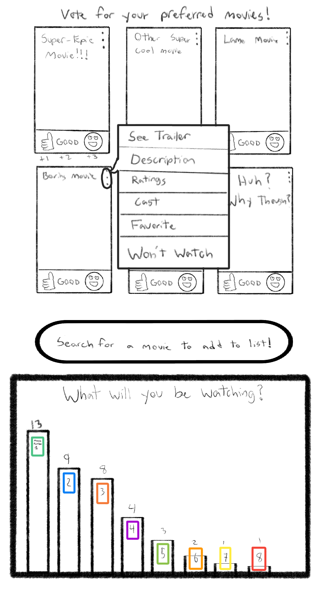

# Your startup name here

[My Notes](notes.md)

My application will be a website where users can log on with their friends to decide what movie to watch. Everyone can submit up to 3 movies, then they will be able to vote together live to see which movie they would most like to watch! While native functionality will be build in to make this more natural with movies, it could also be used to decide between different activities, which restaurant to go to, or other decisions that are often hard to make in group settings!

## 🚀 Specification Deliverable

For this deliverable I did the following. I checked the box `[x]` and added a description for things I completed.

- [x] Proper use of Markdown
- [x] A concise and compelling elevator pitch
- [x] Description of key features
- [x] Description of how you will use each technology
- [x] One or more rough sketches of your application. Images must be embedded in this file using Markdown image references.

### Elevator pitch

Have you ever sat down with your friends or family to watch a movie, but 30 minutes later you are still arguing over what to watch? If so, this is the site for you! This website allows you to log on with your friends and each person can submit up to 3 movies that they are interested in watching. With the build in voting feature, each person can give each movie a `very interested`, `mildly interested`, or `okay, but not my prefered watch` rating. Watch your friends/family vote in real time, and then _voila!_ You can see the top picks liked by all of you to help you decide what movie you want to watch!

### Design

Vertical Phone

Desktop

Vertical Phone with Dropdown Menu
 

The Goal of this design is to be simple and intuitive. There is a clear place to choose what movie you want throug a search bar, and that will add it to the voting. Voters can give movies 1, 2, or 3 points if they want to watch them, and can see the results live in the graph shown at the bottom.

The menu at the top right of each film is used to ask for a description of the movie, see the cast, or get a link to a trailer if they are not familiar with the film. The intention is to be simple and intuitive, avoiding excessive menus and options.

### Key features

- Vote live with your friends based on what movie you would like to watch
- Different teir levels of voting to express how interested you are in a particular movie from very interested to not-at-all.
- Covers of movies shown, with descriptions available from the Streaming Availability API _(descriptions may be left out if too pricy)_

### Technologies

I am going to use the required technologies in the following ways.

- **HTML** - HTML page allowing users to sign in to a group, and another page where they can do the actual voting and searching for movies.
- **CSS** - Prettyification. Making sure that the site looks good in all environments, including desktop and computer. Nice theme and clear indications of where a user should go.
- **React** - Javascript and React will be used to implement the interactivity of new menus generated during voting and showing what movies are on top.
- **Service** - Services used to obtain photos of the movies selected, obtain streaming information for the movies (i.e, where to watch them), and optional links to a trailer/description for those who are not familiar with the film. Also used to implement the voting system.
- **DB/Login** - Must login in order to join a group and vote. Previous choices shared and option to mark movies they have already seen.
- **WebSocket** - Live broadcasting of votes to between members so they can watch the votes unfold live.

## 🚀 AWS deliverable

For this deliverable I did the following. I checked the box `[x]` and added a description for things I completed.

- [x] **Server deployed and accessible with custom domain name** - [My server link](https://startup.samuelmcconkie.com).

## 🚀 HTML deliverable

For this deliverable I did the following. I checked the box `[x]` and added a description for things I completed.

- [x] **HTML pages** - I created 3 different HTML pages that cover the extent of what I entend the final application to do.
- [x] **Proper HTML element usage** - I experamented with many different types of HTML elements including forms for input, header, footer, and main containers, and all of the different elements I needed inside of those.
- [x] **Links** - Links were used to connect the page, allowing the user to navigate from the bar at the top, as well as from the forms and search bars.
- [x] **Text** - The necessary text is there, contained in 
, , <h#>, and other tags.
- [ ] **3rd party API placeholder** - The 3rd part API will be used through the search bar for movies. When a user searchis for a movie, I will be using a Movie Database API that will gather the photo of the movie, as well as information about the movie such as main cast, a sort description, and a link to the trailer. I have three different APIs that I am considering using, and will expirament with those APIs when we get to that stage and see what the final result is. This will be an option when clicking on a movie to request more info.
- [x] **Images** - I used place-holder movie cover images, but the final should use something along these lines as well.
- [x] **Login placeholder** - The main page has everything needed for a login. Currently it only has a place for a username, then a room ID. I plan to implement a slightly different look before signing in where it requires a unique account so that you can store data, then here you will only need the Room ID, but this way felt like a better way to orient this for the sake of this project.
- [x] **DB data placeholder** - the movies page has the option to add a movie to your favorites. Those favorites are stored by user, and can then be accessed on later days when the user logs in so that they can keep track of their favorite movies and the movies they have already watched to make the service easier to use in the future.
- [x] **WebSocket placeholder** - When a user uses the vote button on the movies, they will start to show how many points they have live. As movies gain more points, they will move around so that the number one movie is in the top left, and it continues down to the bottom.

## 🚀 CSS deliverable

For this deliverable I did the following. I checked the box `[x]` and added a description for things I completed.

- [ ] **Header, footer, and main content body** - I did not complete this part of the deliverable.
- [ ] **Navigation elements** - I did not complete this part of the deliverable.
- [ ] **Responsive to window resizing** - I did not complete this part of the deliverable.
- [ ] **Application elements** - I did not complete this part of the deliverable.
- [ ] **Application text content** - I did not complete this part of the deliverable.
- [ ] **Application images** - I did not complete this part of the deliverable.

## 🚀 React part 1: Routing deliverable

For this deliverable I did the following. I checked the box `[x]` and added a description for things I completed.

- [ ] **Bundled using Vite** - I did not complete this part of the deliverable.
- [ ] **Components** - I did not complete this part of the deliverable.
- [ ] **Router** - Routing between login and voting components.

## 🚀 React part 2: Reactivity

For this deliverable I did the following. I checked the box `[x]` and added a description for things I completed.

- [ ] **All functionality implemented or mocked out** - I did not complete this part of the deliverable.
- [ ] **Hooks** - I did not complete this part of the deliverable.

## 🚀 Service deliverable

For this deliverable I did the following. I checked the box `[x]` and added a description for things I completed.

- [ ] **Node.js/Express HTTP service** - I did not complete this part of the deliverable.
- [ ] **Static middleware for frontend** - I did not complete this part of the deliverable.
- [ ] **Calls to third party endpoints** - I did not complete this part of the deliverable.
- [ ] **Backend service endpoints** - I did not complete this part of the deliverable.
- [ ] **Frontend calls service endpoints** - I did not complete this part of the deliverable.

## 🚀 DB/Login deliverable

For this deliverable I did the following. I checked the box `[x]` and added a description for things I completed.

- [ ] **User registration** - I did not complete this part of the deliverable.
- [ ] **User login and logout** - I did not complete this part of the deliverable.
- [ ] **Stores data in MongoDB** - I did not complete this part of the deliverable.
- [ ] **Stores credentials in MongoDB** - I did not complete this part of the deliverable.
- [ ] **Restricts functionality based on authentication** - I did not complete this part of the deliverable.

## 🚀 WebSocket deliverable

For this deliverable I did the following. I checked the box `[x]` and added a description for things I completed.

- [ ] **Backend listens for WebSocket connection** - I did not complete this part of the deliverable.
- [ ] **Frontend makes WebSocket connection** - I did not complete this part of the deliverable.
- [ ] **Data sent over WebSocket connection** - I did not complete this part of the deliverable.
- [ ] **WebSocket data displayed** - I did not complete this part of the deliverable.
- [ ] **Application is fully functional** - I did not complete this part of the deliverable.
